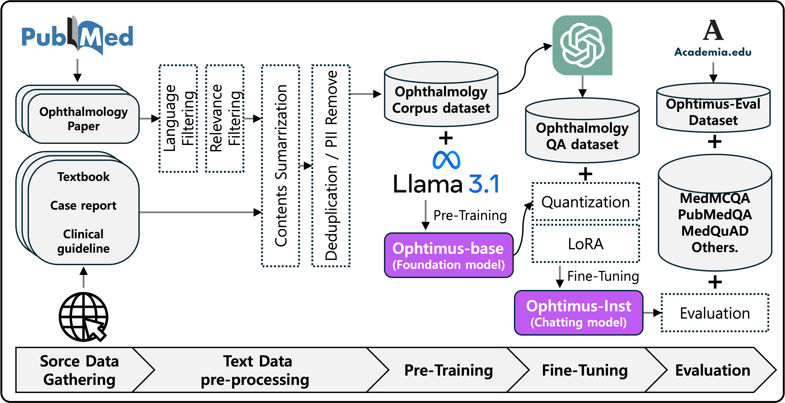

# Ophtimus: Ophthalmology-specific LLM

<p align="left"> 🤗 <a href="https://huggingface.co/collections/BaekSeungJu/ophtimus-series-67d859fedb756527d680ce42">Models and Datasets</a> &nbsp | &nbsp 📕 <a href="https://drive.google.com/file/d/11dpyQioF3eshol3asbFzsNAJ4cEqwm49/view?usp=sharing">AAAI 2025 workshop Paper</a>


## Introduction
Introducing Ophtimus, a large language model (LLM) specialized in the field of ophthalmology. Built with 8 billion parameters, Ophtimus was developed to enhance the practicality and accessibility of medical AI by focusing on ophthalmology-specific data and expertise.
To maximize its capabilities, Ophtimus was trained on carefully selected, high-quality data—including medical papers, textbooks, and research reports—resulting in a model that provides sophisticated and reliable ophthalmic knowledge. During the training process, techniques such as data filtering, summarization, and preprocessing were applied to eliminate extraneous information and emphasize the most critical content.
The model’s architecture is optimized based on Meta’s LLaMA series. By adopting a lightweight design while maintaining high performance, Ophtimus is poised to offer an efficient AI system suitable for real-world applications in clinical support, medical education, and patient consultation assistance.
Ophtimus is notable for its openness and extensibility. Released as open source to advance medical AI, it enables researchers, clinicians, and developers to freely utilize and enhance the model for their own needs, supporting the creation of customized AI systems in ophthalmology. Its development process and data processing pipeline are also disclosed, serving as a valuable reference for anyone looking to build similar domain-specific LLMs in other areas of medicine.

<p align="left">
 
</p>

## Model Details

> [!Note]
> Table의 pre-training, fine-tuning은 본 프로젝트에서 실행한 학습을 의미합니다.  
> Base model들은 이미 이전에 pre-training/fine-tuning을 거친 모델들로 본 프로젝트에서는 transfer learning 하였습니다.

| 모델명 | Base model | 파라미터 | Pre-training | Fine-tuning |
|------|-------------|------------|-------------|------------|
| Ophtimus-Base [[Link](https://huggingface.co/BaekSeungJu/Ophtimus-8B-Base)] | Llama-3.1-8B | 8B | ✅ | ❌ |
| Ophtimus-Llama-1B [[Link](https://huggingface.co/BaekSeungJu/Ophtimus-1B-Instruct)] | Llama-3.2-1B-Instruct | 1B | ❌ | ✅ |
| Ophtimus-Llama-3B [[Link](https://huggingface.co/BaekSeungJu/Ophtimus-3B-Instruct)]| Llama-3.2-3B-Instruct | 3B | ❌ | ✅ |
| Ophtimus-Llama-8B [[Link](https://huggingface.co/BaekSeungJu/Ophtimus-8B-Instruct)] | Llama-3.1-8B-Instruct | 8B | ❌ | ✅ |
| Ophtimus-Instruct-8B [[Link](https://huggingface.co/your-link-here)] | Ophtimus-Base | 8B |✅ | ✅ |

## Performance

> [!Note]
> Multi-Choice QA : Ophtimus-Eval, MedMCQA, PubMedQA | Essay QA : MedQuAD, Medical Flashcards, Medical Wikidoc
> Ophtimus-Eval은 자체적으로 의료 플렛폼에서 수집한 데이터이고, 나머지는 의료 벤치마크 데이터에서 안과학 도메인 QA만을 추출하여 평가하였습니다

<table>
    <thead>
        <tr>
            <th rowspan="2">Model</th>
            <th colspan="3">Multi-Choice Question</th>
            <th colspan="4">Essay Question</th>
        </tr>
        <tr>
            <th>Ophtimus Eval</th>
            <th>MedMCQA (Ophth)</th>
            <th>PubmedQA (Ophth)</th>
            <th>RougeL</th>
            <th>BLEU</th>
            <th>METEOR</th>
            <th>SemScore</th>
        </tr>
    </thead>
    <tbody>
        <tr>
            <td class="highlight">OpenAI GPT-4o</td>
            <td class="highlight">71.95%</td>
            <td class="highlight">81.95%</td>
            <td class="highlight">89.90%</td>
            <td>0.193</td>
            <td>0.082</td>
            <td class="highlight">0.341</td>
            <td class="highlight">0.761</td>
        </tr>
        <tr>
            <td>Llama-3-8B-Instrct</td>
            <td>48.60%</td>
            <td>74.02%</td>
            <td>63.97%</td>
            <td>0.193</td>
            <td>0.064</td>
            <td>0.244</td>
            <td>0.684</td>
        </tr>
        <tr>
            <td>Llama-3.1-8B-Instrct</td>
            <td>39.78%</td>
            <td>57.96%</td>
            <td>83.84%</td>
            <td>0.177</td>
            <td>0.054</td>
            <td>0.215</td>
            <td>0.641</td>
        </tr>
        <tr>
            <td>Eye-Llama</td>
            <td>32.56%</td>
            <td>59.43%</td>
            <td>66.11%</td>
            <td>0.183</td>
            <td>0.062</td>
            <td>0.211</td>
            <td>0.686</td>
        </tr>
        <tr>
            <td>PMC-Llama-13B</td>
            <td>48.28%</td>
            <td>63.45%</td>
            <td>72.48%</td>
            <td>0.223</td>
            <td>0.082</td>
            <td>0.288</td>
            <td>0.714</td>
        </tr>
        <tr>
            <td>Ophtimus-Llama-1B</td>
            <td>41.45%</td>
            <td>45.74%</td>
            <td>61.95%</td>
            <td>0.219</td>
            <td>0.076</td>
            <td>0.217</td>
            <td>0.711</td>
        </tr>
        <tr>
            <td>Ophtimus-Llama-3B</td>
            <td>52.70%</td>
            <td>62.10%</td>
            <td>69.36%</td>
            <td>0.224</td>
            <td>0.077</td>
            <td>0.225</td>
            <td>0.726</td>
        </tr>
        <tr>
            <td>Ophtimus-Llama-8B</td>
            <td>60.78%</td>
            <td>68.25%</td>
            <td>69.70%</td>
            <td class="highlight">0.226</td>
            <td class="highlight">0.083</td>
            <td>0.230</td>
            <td>0.733</td>
        </tr>
        <tr>
            <td>Ophtimus-Instruct-8B</td>
            <td>63.85%</td>
            <td>71.51%</td>
            <td>72.73%</td>
            <td>0.222</td>
            <td>0.079</td>
            <td>0.224</td>
            <td class="highlight">0.735</td>
        </tr>
    </tbody>
</table>

</body>
</html>

## Quickstart

### Install Dependencies

```bash
cd Ophtimus-Ophthalmology-LLM
pip install -r requirements.txt
```

### Ophtimus Inference

```python
import torch
from transformers import AutoModelForCausalLM, AutoTokenizer

# model_name example : BaekSeungJu/Ophtimus-Instruct-8B or Ophtimus-Llama-1B or Ophtimus-Llama-3B or Ophtimus-Llama-8B
model_name = "BaekSeungJu/Ophtimus-Instruct-8B"

model = AutoModelForCausalLM.from_pretrained(
    model_name,
    torch_dtype=torch.bfloat16,
    trust_remote_code=True,
).to("cuda")

tokenizer = AutoTokenizer.from_pretrained(model_name, padding_side="left")
tokenizer.pad_token = tokenizer.eos_token

system_instruction = (
    "You are an expert ophthalmologist. Please provide accurate and "
    "medically sound answers to the user's ophthalmology-related question."
)

# 여러 질문을 리스트에 담습니다.
questions = [
    "Please describe the symptoms and treatment of epiretinal membrane.",
    "What's good for eyes?"
]

prompts = []
for question in questions:
    row_json = [
        {"role": "system", "content": system_instruction},
        {"role": "user", "content": question}
    ]
    prompt = tokenizer.apply_chat_template(row_json, add_generation_prompt=True, tokenize=False)
    prompts.append(prompt)

input_ids = tokenizer(
    prompts,
    padding=True,
    return_tensors="pt",
)["input_ids"].to("cuda")

model.eval()
with torch.no_grad():
    outputs = model.generate(
        input_ids,
        max_new_tokens=1024,
        do_sample=False,
    )

decoded = tokenizer.batch_decode(outputs, skip_special_tokens=False)
for i, text in enumerate(decoded):
    print(f"------------------------\nAnswer for question {i+1}:\n{text}")
```

## Pre-Training

```bash
python Pre-Trainin.py --num_train_epochs 3 --per_device_train_batch_size 4
```
