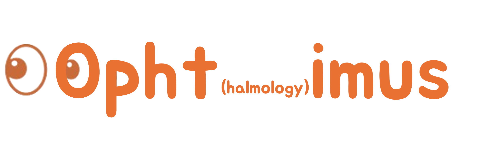

# Ophtimus: Ophthalmology-specific LLM

 
    <picture>
        
    </picture>
 

 🤗 <a href="https://huggingface.co/collections/BaekSeungJu/ophtimus-series-67d859fedb756527d680ce42">Models and Datasets</a> &nbsp

## Introduction
안과 분야에 특화된 대형 언어 모델(LLM)인 Ophtimus를 소개합니다. Ophtimus는 의료 인공지능의 실용성과 접근성을 높이기 위해 개발된 80억 개의 파라미터를 가진 전문 모델입니다. 기존의 범용 LLM이 특정 의료 분야에서 한계를 보이는 문제를 해결하고자, Ophtimus는 안과 데이터를 중심으로 사전 학습과 미세 조정을 거쳐 고도의 도메인 지식을 학습했습니다. 
Ophtimus는 안과 전문성을 극대화하기 위해 도메인 특화 데이터 학습을 기반으로 구축되었습니다. 의료 논문, 교과서, 연구 보고서 등의 고품질 데이터를 선별하여 모델의 정확성을 높였으며, 이를 통해 일반적인 의료 AI보다 더 정교하고 신뢰할 수 있는 안과 지식을 제공할 수 있습니다. 또한, 학습 과정에서 데이터 필터링, 요약 및 전처리 기법을 활용하여 불필요한 정보는 배제하고 핵심 내용을 효과적으로 학습하도록 설계되었습니다. 
모델의 구조는 Meta의 LLaMA 시리즈를 기반으로 하여 최적화되었습니다. 고성능을 유지하면서도 경량화된 구조를 채택하여 의료 환경에서 실제로 활용 가능한 효율적인 AI 시스템을 목표로 했습니다. 이를 통해 Ophtimus는 단순한 연구용 모델을 넘어 임상 지원, 의료 교육, 환자 상담 보조 등의 실질적인 응용 가능성을 보유하고 있습니다.
Ophtimus의 중요한 특징 중 하나는 개방성과 확장성입니다. 의료 AI의 발전을 촉진하기 위해 오픈소스로 공개되어 누구나 활용하고 개선할 수 있도록 설계되었습니다. 이를 통해 연구자, 의료진, 개발자들이 보다 쉽게 안과 전문 LLM을 활용하고, 맞춤형 의료 AI 시스템을 구축할 수 있습니다. 또한, Ophtimus의 개발 과정과 데이터 처리 파이프라인도 공개되어 있어, 다른 의료 분야에서도 유사한 도메인 특화 LLM을 개발하는 데 참고할 수 있는 사례를 제공합니다.

 

## Model Details

> [!Note]
> Table의 pre-training, fine-tuning은 본 프로젝트에서 실행한 학습을 의미합니다.  
> Base model들은 이미 이전에 pre-training/fine-tuning을 거친 모델들로 본 프로젝트에서는 transfer learning 하였습니다.

| 모델명 | Base model | 파라미터 | Pre-training | Fine-tuning |
|------|-------------|------------|-------------|------------|
| Ophtimus-Base [[Link](https://huggingface.co/BaekSeungJu/Ophtimus-8B-Base)] | Llama-3.1-8B | 8B | ✅ | ❌ |
| Ophtimus-Llama-1B [[Link](https://huggingface.co/BaekSeungJu/Ophtimus-1B-Instruct)] | Llama-3.2-1B-Instruct | 1B | ❌ | ✅ |
| Ophtimus-Llama-3B [[Link](https://huggingface.co/BaekSeungJu/Ophtimus-3B-Instruct)]| Llama-3.2-3B-Instruct | 3B | ❌ | ✅ |
| Ophtimus-Llama-8B [[Link](https://huggingface.co/BaekSeungJu/Ophtimus-8B-Instruct)] | Llama-3.1-8B-Instruct | 8B | ❌ | ✅ |
| Ophtimus-Instruct-8B [[Link](https://huggingface.co/your-link-here)] | Ophtimus-Base | 8B |✅ | ✅ |

