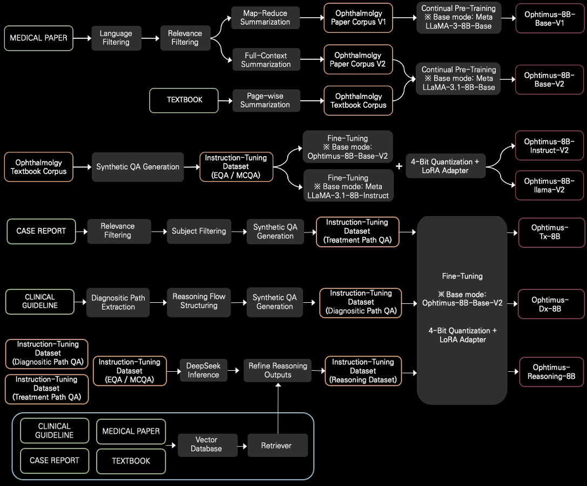

# Ophtimus: Ophthalmology-specific LLM


 


<p align="left"> 🤗 <a href="https://huggingface.co/collections/BaekSeungJu/ophtimus-series-67d859fedb756527d680ce42">Models and Datasets</a> &nbsp | &nbsp 📕 <a href="https://openreview.net/forum?id=dIJPlNKhgv">AAAI 2025 workshop Paper</a>

## Introduction
Ophtimus is an open-source large language model (LLM) specialized in ophthalmology, built with 8 billion parameters based on the LLaMA architecture. It was trained on carefully curated ophthalmology-specific data, including medical papers, textbooks, and research reports. Through filtering, summarization, and preprocessing, only the most relevant and high-quality information was retained.  
Designed to be both lightweight and high-performing, Ophtimus is suitable for real-world applications such as clinical decision support, medical education, and patient communication. The model and its training pipeline are fully open-sourced, providing a practical reference for developing similar domain-specific LLMs in other areas of medicine.

<p align="left">
 
</p>

## Dataset Details

> [!Note]
> All datasets were either newly constructed or adapted for this project.  
> Pre-training datasets were curated from open-source ophthalmology materials, while instruction-tuning and evaluation datasets were built by extracting only ophthalmology-relevant samples from broader medical corpora.  
> All data underwent preprocessing steps including deduplication, language filtering (English only), and removal of any personally identifiable information (PII).


| Dataset name | Source | Size | Purpose | Key Features |
|------|-------------|------------|-------------|------------|
| Ophthalmology-pubmed-corpus [[Link](https://huggingface.co/datasets/BaekSeungJu/Ophthalmology-PubMed-Corpus)] | Ophthalmology paper | 18.4M Tokens | Pre-Training | • Map-reduce method summary<br>• Broad ophthalmic keywords|
| Ophthalmology-textbook-corpus [[Link](https://huggingface.co/datasets/BaekSeungJu/Ophthalmology-Textbook-Corpus)] | Ophthalmology textbook | 4M Tokens | Pre-Training | • Trusted medical sources<br>• Rich in diagnostic cases |
| Opthalmology MCQA Inst dataset [[Link](https://huggingface.co/datasets/BaekSeungJu/Ophthalmology-MCQA-v3)]| Ophthalmology Docs | 51.7k QAs | Inst-Tuning | • Diverse multiple-choice formats<br>• Reasoning included<br>• Variety of ophthalmic topics |
| Opthalmology EQA Inst dataset [[Link](https://huggingface.co/datasets/BaekSeungJu/Ophthalmology-EQA-v3)] | Ophthalmology Docs | 49.3k QAs | Inst-Tuning | • Variety of ophthalmic topics |
| Ophtimus-Eval-Dataset [[Link](https://huggingface.co/datasets/BaekSeungJu/OphtimusEval-Dataset)] | Medical platform data | 2,153 QAs | Evaluation | • expert-verified data<br>• MCQA dataset|
| PubMedQA-ophthal-Dataset [[Link](https://huggingface.co/datasets/BaekSeungJu/PubMedQA-Ophthal-Dataset)] | PubMedQA | 297 QAs | Evaluation | • 	Ophthalmology domain filtered<br>• True/False MCQA dataset |
| MedMCQA-Ophthal-Dataset [[Link](https://huggingface.co/datasets/BaekSeungJu/MedMCQA-Ophthal-Dataset)] | MedMCQA | 6,932 QAs | Evaluation | • 	Ophthalmology domain filtered<br>• MCQA dataset |
| EQAEval-Dataset [[Link](https://huggingface.co/datasets/BaekSeungJu/EQAEval-Ophthal-Dataset)] | MedQuAD, Others | 1,389 QAs | Evaluation | • Diverse open-source datasets<br>• Ophthalmology domain filtered<br>• Essay QA |

## Model Details

> [!Note]
> The "pre-training" and "fine-tuning" columns in the table refer to the training performed in this project.  
> The base models had already undergone pre-training and/or fine-tuning prior to this project, and we applied transfer learning using those models.

| Model name | Base model | Parameters | Pre-training | Instruction-tuning |
|------|-------------|------------|-------------|------------|
| Ophtimus-Base [[Link](https://huggingface.co/BaekSeungJu/Ophtimus-8B-Base)] | Llama-3.1-8B | 8B | ✅ | ❌ |
| Ophtimus-Llama-1B [[Link](https://huggingface.co/BaekSeungJu/Ophtimus-1B-Instruct)] | Llama-3.2-1B-Instruct | 1B | ❌ | ✅ |
| Ophtimus-Llama-3B [[Link](https://huggingface.co/BaekSeungJu/Ophtimus-3B-Instruct)]| Llama-3.2-3B-Instruct | 3B | ❌ | ✅ |
| Ophtimus-Llama-8B [[Link](https://huggingface.co/BaekSeungJu/Ophtimus-8B-Instruct)] | Llama-3.1-8B-Instruct | 8B | ❌ | ✅ |
| Ophtimus-Instruct-8B [[Link](https://huggingface.co/your-link-here)] | Ophtimus-Base | 8B |✅ | ✅ |

## Performance

> [!Note]
> Multi-Choice QA: Ophtimus-Eval, MedMCQA, PubMedQA | Essay QA: MedQuAD, Medical Flashcards, Medical Wikidoc  
> Ophtimus-Eval is a proprietary dataset collected from a medical platform. The others are established medical benchmark datasets, from which only ophthalmology-related QA pairs were extracted for evaluation.

<table>
    <thead>
        <tr>
            <th rowspan="2">Model</th>
            <th colspan="3">Multi-Choice Question</th>
            <th colspan="4">Essay Question</th>
        </tr>
        <tr>
            <th>Ophtimus Eval</th>
            <th>MedMCQA (Ophth)</th>
            <th>PubmedQA (Ophth)</th>
            <th>RougeL</th>
            <th>BLEU</th>
            <th>METEOR</th>
            <th>SemScore</th>
        </tr>
    </thead>
    <tbody>
        <tr>
            <td class="highlight">OpenAI GPT-4o</td>
            <td class="highlight">71.95%</td>
            <td class="highlight">81.95%</td>
            <td class="highlight">89.90%</td>
            <td>0.193</td>
            <td>0.082</td>
            <td class="highlight">0.341</td>
            <td class="highlight">0.761</td>
        </tr>
        <tr>
            <td>Llama-3-8B-Instrct</td>
            <td>48.60%</td>
            <td>74.02%</td>
            <td>63.97%</td>
            <td>0.193</td>
            <td>0.064</td>
            <td>0.244</td>
            <td>0.684</td>
        </tr>
        <tr>
            <td>Llama-3.1-8B-Instrct</td>
            <td>39.78%</td>
            <td>57.96%</td>
            <td>83.84%</td>
            <td>0.177</td>
            <td>0.054</td>
            <td>0.215</td>
            <td>0.641</td>
        </tr>
        <tr>
            <td>Eye-Llama</td>
            <td>32.56%</td>
            <td>59.43%</td>
            <td>66.11%</td>
            <td>0.183</td>
            <td>0.062</td>
            <td>0.211</td>
            <td>0.686</td>
        </tr>
        <tr>
            <td>PMC-Llama-13B</td>
            <td>48.28%</td>
            <td>63.45%</td>
            <td>72.48%</td>
            <td>0.223</td>
            <td>0.082</td>
            <td>0.288</td>
            <td>0.714</td>
        </tr>
        <tr>
            <td>Ophtimus-Llama-1B</td>
            <td>41.45%</td>
            <td>45.74%</td>
            <td>61.95%</td>
            <td>0.219</td>
            <td>0.076</td>
            <td>0.217</td>
            <td>0.711</td>
        </tr>
        <tr>
            <td>Ophtimus-Llama-3B</td>
            <td>52.70%</td>
            <td>62.10%</td>
            <td>69.36%</td>
            <td>0.224</td>
            <td>0.077</td>
            <td>0.225</td>
            <td>0.726</td>
        </tr>
        <tr>
            <td>Ophtimus-Llama-8B</td>
            <td>60.78%</td>
            <td>68.25%</td>
            <td>69.70%</td>
            <td class="highlight">0.226</td>
            <td class="highlight">0.083</td>
            <td>0.230</td>
            <td>0.733</td>
        </tr>
        <tr>
            <td>Ophtimus-Instruct-8B</td>
            <td>63.85%</td>
            <td>71.51%</td>
            <td>72.73%</td>
            <td>0.222</td>
            <td>0.079</td>
            <td>0.224</td>
            <td class="highlight">0.735</td>
        </tr>
    </tbody>
</table>

</body>
</html>

## Quickstart

### Install Dependencies

```bash
cd Ophtimus-Ophthalmology-LLM
pip install -r requirements.txt
```

### Ophtimus Inference

```python
import torch
from transformers import AutoModelForCausalLM, AutoTokenizer

# model_name example : BaekSeungJu/Ophtimus-Instruct-8B or Ophtimus-Llama-1B or Ophtimus-Llama-3B or Ophtimus-Llama-8B
model_name = "BaekSeungJu/Ophtimus-Instruct-8B"

model = AutoModelForCausalLM.from_pretrained(
    model_name,
    torch_dtype=torch.bfloat16,
    trust_remote_code=True,
).to("cuda")

tokenizer = AutoTokenizer.from_pretrained(model_name, padding_side="left")
tokenizer.pad_token = tokenizer.eos_token

system_instruction = (
    "You are an expert ophthalmologist. Please provide accurate and "
    "medically sound answers to the user's ophthalmology-related question."
)

# Enter your questions in the list
questions = [
    "Please describe the symptoms and treatment of epiretinal membrane.",
    "What's good for eyes?"
]

prompts = []
for question in questions:
    row_json = [
        {"role": "system", "content": system_instruction},
        {"role": "user", "content": question}
    ]
    prompt = tokenizer.apply_chat_template(row_json, add_generation_prompt=True, tokenize=False)
    prompts.append(prompt)

input_ids = tokenizer(
    prompts,
    padding=True,
    return_tensors="pt",
)["input_ids"].to("cuda")

model.eval()
with torch.no_grad():
    outputs = model.generate(
        input_ids,
        max_new_tokens=1024,
        do_sample=False,
    )

decoded = tokenizer.batch_decode(outputs, skip_special_tokens=False)
for i, text in enumerate(decoded):
    print(f"------------------------\nAnswer for question {i+1}:\n{text}")
```
