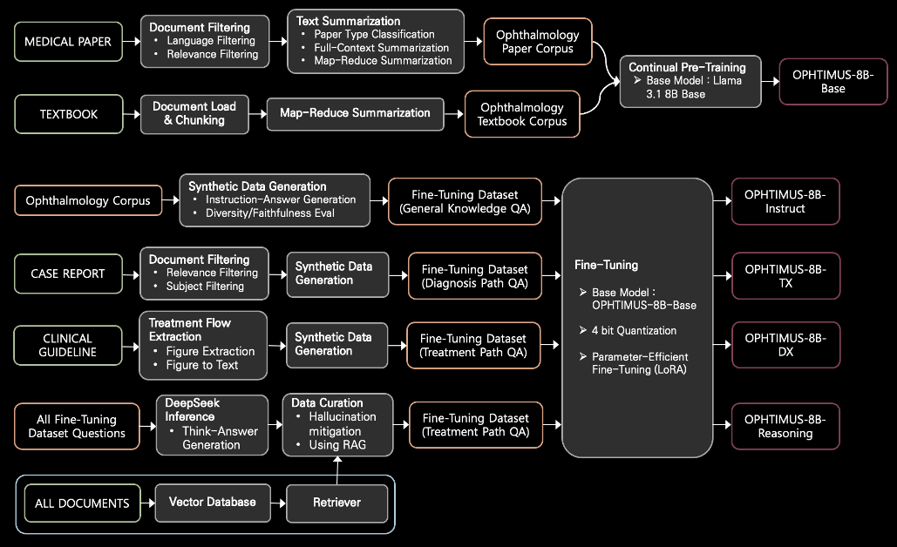

# Ophthalmology-Domain-specific-LLM : OPHTIMUS


<p align="left"> 🤗 <a href="https://huggingface.co/collections/BaekSeungJu/ophtimus-series-67d859fedb756527d680ce42">Models and Datasets</a> &nbsp | &nbsp 📕 <a href="https://openreview.net/forum?id=dIJPlNKhgv">AAAI 2025 Workshop Paper</a>

## Introduction

Ophtimus is an open-source large language model (LLM) specialized in ophthalmology, built with 8 billion parameters based on the LLaMA architecture. It was trained on carefully curated ophthalmology-specific data, including medical papers, textbooks, and research reports. Through filtering, summarization, and preprocessing, only the most relevant and high-quality information was retained.

Designed to be both lightweight and high-performing, Ophtimus is suitable for real-world applications such as clinical decision support, medical education, and patient communication. The model and its training pipeline are fully open-sourced, providing a practical reference for developing similar domain-specific LLMs in other areas of medicine.

<p align="left">
  
</p>

## Dataset Details

> [!Note]
> All datasets were either newly constructed or adapted for this project.
> Pre-training datasets were curated from open-source ophthalmology materials, while instruction-tuning and evaluation datasets were built by extracting only ophthalmology-relevant samples from broader medical corpora.
> All data underwent preprocessing steps including deduplication, language filtering (English only), and removal of any personally identifiable information (PII).

| Dataset | Source | Size | Purpose | Key Features |
|---------|--------|------|---------|-------------|
| Ophthalmology-PubMed-Corpus [[Link](https://huggingface.co/datasets/BaekSeungJu/Ophthalmology-PubMed-Corpus)] | Ophthalmology papers | 18.4M tokens | Pre-Training | Map-reduce summarization, broad ophthalmic keywords |
| Ophthalmology-Textbook-Corpus [[Link](https://huggingface.co/datasets/BaekSeungJu/Ophthalmology-Textbook-Corpus)] | Ophthalmology textbooks | 4M tokens | Pre-Training | Trusted medical sources, rich in diagnostic cases |
| Ophthalmology-MCQA-v3 [[Link](https://huggingface.co/datasets/BaekSeungJu/Ophthalmology-MCQA-v3)] | Ophthalmology docs | 51.7k QAs | Instruction Tuning | Diverse multiple-choice formats, reasoning included |
| Ophthalmology-EQA-v3 [[Link](https://huggingface.co/datasets/BaekSeungJu/Ophthalmology-EQA-v3)] | Ophthalmology docs | 49.3k QAs | Instruction Tuning | Open-ended essay QA, variety of ophthalmic topics |
| OphtimusEval-Dataset [[Link](https://huggingface.co/datasets/BaekSeungJu/OphtimusEval-Dataset)] | Medical platform data | 2,153 QAs | Evaluation | Expert-verified, MCQA format |
| PubMedQA-Ophthal-Dataset [[Link](https://huggingface.co/datasets/BaekSeungJu/PubMedQA-Ophthal-Dataset)] | PubMedQA | 297 QAs | Evaluation | Ophthalmology domain filtered, True/False MCQA |
| MedMCQA-Ophthal-Dataset [[Link](https://huggingface.co/datasets/BaekSeungJu/MedMCQA-Ophthal-Dataset)] | MedMCQA | 6,932 QAs | Evaluation | Ophthalmology domain filtered, MCQA format |
| EQAEval-Ophthal-Dataset [[Link](https://huggingface.co/datasets/BaekSeungJu/EQAEval-Ophthal-Dataset)] | MedQuAD, others | 1,389 QAs | Evaluation | Diverse open-source datasets, essay QA |

## Model Details

> [!Note]
> The "Pre-Training" and "Instruction Tuning" columns refer to training performed in this project.
> Base models had already undergone their own pre-training prior to this project; we applied transfer learning on top of them.

| Model | Base Model | Parameters | Pre-Training | Instruction Tuning |
|-------|-----------|-----------|-------------|-------------------|
| Ophtimus-Base [[Link](https://huggingface.co/BaekSeungJu/Ophtimus-8B-Base)] | Llama-3.1-8B | 8B | ✅ | ❌ |
| Ophtimus-Llama-1B [[Link](https://huggingface.co/BaekSeungJu/Ophtimus-1B-Instruct)] | Llama-3.2-1B-Instruct | 1B | ❌ | ✅ |
| Ophtimus-Llama-3B [[Link](https://huggingface.co/BaekSeungJu/Ophtimus-3B-Instruct)] | Llama-3.2-3B-Instruct | 3B | ❌ | ✅ |
| Ophtimus-Llama-8B [[Link](https://huggingface.co/BaekSeungJu/Ophtimus-8B-Instruct)] | Llama-3.1-8B-Instruct | 8B | ❌ | ✅ |
| Ophtimus-Instruct-8B | Ophtimus-Base | 8B | ✅ | ✅ |

## Performance

> [!Note]
> **Multi-Choice QA**: OphtimusEval, MedMCQA (Ophth), PubMedQA (Ophth)
> **Essay QA**: MedQuAD, Medical Flashcards, Medical Wikidoc
>
> OphtimusEval is a proprietary dataset collected from a medical platform. The other benchmarks are established medical datasets filtered to ophthalmology-related QA pairs.

| Model | OphtimusEval | MedMCQA (Ophth) | PubMedQA (Ophth) | RougeL | BLEU | METEOR | SemScore |
|-------|-------------|----------------|-----------------|--------|------|--------|---------|
| GPT-4o | **71.95%** | **81.95%** | **89.90%** | 0.193 | 0.082 | **0.341** | **0.761** |
| Llama-3-8B-Instruct | 48.60% | 74.02% | 63.97% | 0.193 | 0.064 | 0.244 | 0.684 |
| Llama-3.1-8B-Instruct | 39.78% | 57.96% | 83.84% | 0.177 | 0.054 | 0.215 | 0.641 |
| Eye-Llama | 32.56% | 59.43% | 66.11% | 0.183 | 0.062 | 0.211 | 0.686 |
| PMC-Llama-13B | 48.28% | 63.45% | 72.48% | 0.223 | 0.082 | 0.288 | 0.714 |
| Ophtimus-Llama-1B | 41.45% | 45.74% | 61.95% | 0.219 | 0.076 | 0.217 | 0.711 |
| Ophtimus-Llama-3B | 52.70% | 62.10% | 69.36% | 0.224 | 0.077 | 0.225 | 0.726 |
| Ophtimus-Llama-8B | 60.78% | 68.25% | 69.70% | **0.226** | **0.083** | 0.230 | 0.733 |
| Ophtimus-Instruct-8B | 63.85% | 71.51% | 72.73% | 0.222 | 0.079 | 0.224 | 0.735 |

## Project Structure

```
Ophtimus-Ophthalmology-LLM/
├── Train/                  # Training scripts (pre-training, instruction tuning, LoRA merge)
├── Evaluation/             # Evaluation scripts (MCQA, EQA, RAGAS, etc.)
├── Data/                   # Data collection and preprocessing scripts
│   ├── corpus/             # PDF parsing and corpus construction
│   ├── Instruction/        # Synthetic instruction data generation (EQA, MCQA)
│   └── utils/              # Token counting, summarization utilities
├── serve/                  # API serving (FastAPI + vLLM, Docker)
├── utils/                  # HuggingFace dataset uploader and other utilities
├── Images/                 # Architecture diagrams
├── requirements.txt        # Dependencies for training and evaluation
└── .env_sample             # Environment variable sample
```

## Quickstart

### 1. Install Dependencies

```bash
git clone https://github.com/BaekSeungJu/Ophtimus-Ophthalmology-LLM.git
cd Ophtimus-Ophthalmology-LLM
pip install -r requirements.txt
```

### 2. Environment Setup

Copy `.env_sample` to `.env` and fill in the required values.

```bash
cp .env_sample .env
```

| Variable | Description |
|----------|-------------|
| `HF_TOKEN` | HuggingFace token for downloading models and uploading datasets |
| `OPENAI_API_KEY` | OpenAI API key used during evaluation (GPT-4o-mini) and data generation |

### 3. Inference

```python
import torch
from transformers import AutoModelForCausalLM, AutoTokenizer

# Available models:
# BaekSeungJu/Ophtimus-Instruct-8B
# BaekSeungJu/Ophtimus-Llama-8B
# BaekSeungJu/Ophtimus-Llama-3B
# BaekSeungJu/Ophtimus-Llama-1B
model_name = "BaekSeungJu/Ophtimus-Instruct-8B"

model = AutoModelForCausalLM.from_pretrained(
    model_name,
    torch_dtype=torch.bfloat16,
    trust_remote_code=True,
).to("cuda")

tokenizer = AutoTokenizer.from_pretrained(model_name, padding_side="left")
tokenizer.pad_token = tokenizer.eos_token

system_instruction = (
    "You are an expert ophthalmologist. Please provide accurate and "
    "medically sound answers to the user's ophthalmology-related question."
)

questions = [
    "Please describe the symptoms and treatment of epiretinal membrane.",
    "What's good for eyes?"
]

prompts = []
for question in questions:
    row_json = [
        {"role": "system", "content": system_instruction},
        {"role": "user", "content": question}
    ]
    prompt = tokenizer.apply_chat_template(row_json, add_generation_prompt=True, tokenize=False)
    prompts.append(prompt)

input_ids = tokenizer(
    prompts,
    padding=True,
    return_tensors="pt",
)["input_ids"].to("cuda")

model.eval()
with torch.no_grad():
    outputs = model.generate(
        input_ids,
        max_new_tokens=1024,
        do_sample=False,
    )

decoded = tokenizer.batch_decode(outputs, skip_special_tokens=False)
for i, text in enumerate(decoded):
    print(f"------------------------\nAnswer for question {i+1}:\n{text}")
```

### 4. Instruction Data Generation

You can generate synthetic instruction-tuning datasets from your own ophthalmology corpus.  
Scripts in `Data/Instruction/` take corpus text as input and automatically produce QA pairs via a LangGraph pipeline.

**Pipeline flow**

```
Corpus text input
    → ① Generate QA pairs    (gpt-4o-mini)
    → ② Evaluate quality     (gpt-4o-mini)
    → ③ Regenerate if failed (gpt-4o, up to 2 retries)
    → Save accepted QA pairs
```

**Essay QA (EQA)**

```bash
python Data/Instruction/synthetic-data-generation-eqa.py
```

- Input: `Data/corpus/textbook/formatted-textbooks.xlsx`
- Output: `Data/Instruction/generated-eqa-data.xlsx`

**Multiple Choice QA (MCQA)**

```bash
python Data/Instruction/synthetic-data-generation-mcqa.py
```

- Input: `Data/corpus/textbook/formatted-textbooks.xlsx`
- Output: `Data/Instruction/generated-mcqa-data.xlsx`

> [!Note]
> An OpenAI API key (`OPENAI_API_KEY`) is required for data generation.  
> Generated datasets can be uploaded to HuggingFace Hub using `utils/hf_dataset_uploader.py`.

### 5. Training

Training scripts are located in the `Train/` directory.

**Step 1 — Pre-Training** (domain-adaptive pre-training on ophthalmology corpus)

```bash
python Train/Pre-Training.py
```

- Base model: `Llama-3.1-8B`
- Supports distributed training via DeepSpeed (`Train/deepspeed_confug.json`)

**Step 2 — Instruction Tuning** (fine-tuning on MCQA + EQA datasets)

```bash
python Train/Instruction_Tuning_v2.py
```

- 4-bit quantization + LoRA (r=32) for memory-efficient training
- Base model: `BaekSeungJu/Ophtimus-8B-Base`

**Step 3 — LoRA Adapter Merge** (merge adapter weights into the base model)

```bash
python Train/LoRA_adapter_merge.py
```

### 6. Evaluation

Evaluation scripts are located in the `Evaluation/` directory.

**Multi-Choice QA (topic-wise accuracy)**

```bash
# Step 1: Run model inference
python Evaluation/Topicwise_Evaluation/Model_inference.py

# Step 2: Calculate accuracy
python Evaluation/Topicwise_Evaluation/Evaluating_topic_accuracy.py
```

**Essay QA (RougeL, BLEU, METEOR, SemScore)**

```bash
# Step 1: Run model inference
python Evaluation/EQA-Evaluation/Model-inference.py

# Step 2: Calculate metrics
python Evaluation/EQA-Evaluation/Heuristic-Evaluating-matrics.py
```

### 7. API Serving (Docker)

Use Docker Compose in the `serve/` directory to run the vLLM + FastAPI server.

```bash
cd serve
cp .env.example .env  # configure environment variables
docker compose up -d
```

Once running, the server exposes an OpenAI-compatible API.

```bash
# Health check
curl http://localhost:8000/health

# Chat completion example
curl http://localhost:8000/v1/chat/completions \
  -H "Content-Type: application/json" \
  -H "X-API-Key: your-api-key" \
  -d '{
    "model": "ophtimus",
    "messages": [{"role": "user", "content": "What causes glaucoma?"}]
  }'
```

For a full client usage example, see `serve/client_example.py`.

| Service | Port | Description |
|---------|------|-------------|
| FastAPI Gateway | 8000 | Authentication and routing (externally accessible) |
| vLLM Server | 8001 | Model inference engine (internal only) |
